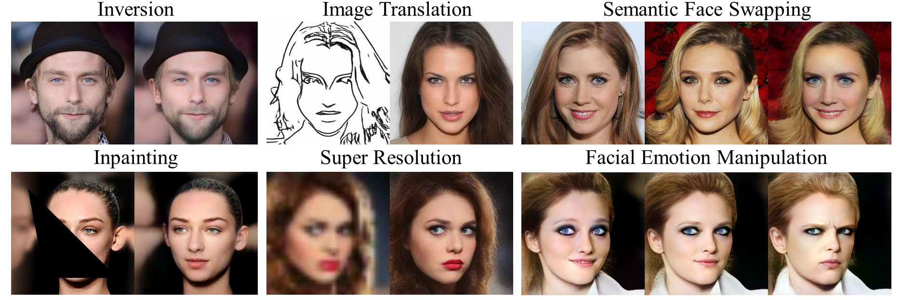

# A Simple Baseline for StyleGAN Inversion
This repository hosts the official PyTorch implementation of the paper: "**A Simple Baseline for StyleGAN Inversion**".

 * [Project Page](https://wty-ustc.github.io/inversion)
 * [Paper](https://wty-ustc.github.io/inversion/paper/A%20Simple%20Baseline%20for%20StyleGAN%20Inversion.pdf)
 * [Video Inversion Examples](https://youtu.be/gJwFgdRHK0M)

Note that `Once our paper is accepted, we will release the code and pre-trained models. Please stay tuned.`




Tianyi Wei<sup>1</sup>,
Dongdong Chen<sup>2</sup>,
Wenbo Zhou<sup>1</sup>,
Jing Liao<sup>3</sup>,
Weiming Zhang<sup>1</sup>, 
Lu Yuan<sup>2</sup>, 
Gang Hua<sup>4</sup>, 
Nenghai Yu<sup>1</sup> <br>
<sup>1</sup>University of Science and Technology of China, <sup>2</sup>Microsoft Cloud AI <br>
<sup>3</sup>City University of Hong Kong, <sup>4</sup>Wormpex AI Research


## Abstract
This paper studies the problem of StyleGAN inversion, which plays an essential role in enabling the pretrained StyleGAN to be used for real facial image editing tasks. This problem has the high demand for quality and efficiency. Existing optimization-based methods can produce high quality results, but the optimization often takes a long time. On the contrary, forward-based methods are usually faster but the quality of their results is inferior. In this paper, we present a new feed-forward network for StyleGAN inversion, with significant improvement in terms of efficiency and quality. In our inversion network, we introduce: 1) a shallower backbone with multiple efficient heads across scales; 2) multi-layer identity loss and multi-layer face parsing loss to the loss function; and 3) multi-stage refinement. Combining these designs together forms a simple and efficient baseline method which exploits all benefits of optimization-based and forward-based methods. Quantitative and qualitative results show that our method performs better than existing forward-based methods and comparably to state-of-the-art optimization-based methods, while maintaining the high efficiency as well as forward-based methods. Moreover, a number of real image editing applications demonstrate the efficacy of our method.


## To Do
- [ ] Release testing code
- [ ] Release pretrained model
- [ ] Release training code


## Citation

If you find our work useful for your research, please consider citing the following papers :)

```
@article{wei2021simpleinversion,
  title={A Simple Baseline for StyleGAN Inversion},
  author={Wei, Tianyi and Chen, Dongdong and Zhou, Wenbo and Liao, Jing and Zhang, Weiming and Yuan, Lu and Hua, Gang and Yu, Nenghai},
  journal={arXiv preprint arXiv:2104.07661},
  year={2021}
}
```

